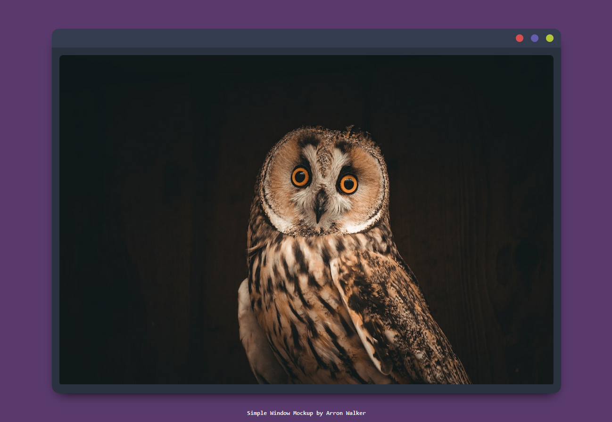

## Window Mockup

I frequently present work using a mock-up like this built in Adobe Illustrator. I thought it would be quite handy to have a readymade template to just slot an image into without depending on any editing software.

To use this, just change the URL src attribute on the img element from "https://source.unsplash.com/random" to reference your own image.

You can also change the CSS colours using the CSS variables in the root declaration.

